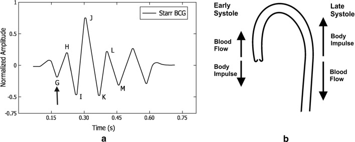

# Cardiography

- [ECG](https://en.wikipedia.org/wiki/Electrocardiography) (Electrocartiography)
  - Electrocardiography is the process of producing an electrocardiogram, a recording of the heart's electrical activity.
- [PPG](https://en.wikipedia.org/wiki/Photoplethysmogram) (Photoplethysmography)
  - A photoplethysmogram is an optically obtained plethysmogram that can be used to detect blood volume changes in the microvascular bed of tissue.
  - A PPG is often obtained by using a pulse oximeter which illuminates the skin and measures changes in light absorption.
- [BCG](https://en.wikipedia.org/wiki/Ballistocardiography) (Ballistocardiography)
  - The ballistocardiograph is a measure of ballistic forces generated by the heart.

---

## Papers

 

### BCG & SCG & FSR

| Year | Paper                                                                                                         | Target | Reference | Metric        | Description            |
| ---- | ------------------------------------------------------------------------------------------------------------- | ------ | --------- | ------------- | ---------------------- |
| 2009 | [Pinheiro et al.](http://www.av.it.pt/conftele2009/Papers/94.pdf)                                             | BCG    |           | RMSE          | chair HRV estimation   |
| 2011 | [Giovangrandi et al.](https://www.ncbi.nlm.nih.gov/pmc/articles/PMC4274997/)                                  |        |           |               |                        |
| 2014 | [Inan et al.](https://ieeexplore.ieee.org/document/6916998)                                                   |        |           |               | review                 |
| 2016 | [Kim et al.](https://www.nature.com/articles/srep31297)                                                       | BCG    |           |               | waveform model         |
| 2017 | [Etemadi et al.](https://journals.physiology.org/doi/full/10.1152/japplphysiol.00298.2017)                    |        |           |               | wearable               |
| 2019 | [Sadek et al.](https://link.springer.com/article/10.1007/s13755-019-0071-7)                                   |        |           |               | review                 |
| 2019 | [Taebi et al.](https://www.mdpi.com/2571-631X/2/1/5)                                                          |        |           |               | SCG                    |
| 2020 | [Mora et al.](https://ieeexplore.ieee.org/document/9103629)                                                   | BCG    | ECG       |               |                        |
| 2020 | [Carlson et al.](https://www.mdpi.com/1424-8220/21/1/156)                                                     | BCG    |           |               | bed dataset            |
| 2020 | [Allataifeh et al.](https://www.nature.com/articles/s41598-019-57326-6)                                       |        |           |               | Chest piezoelectric    |
| 2020 | [Mitsukura et al.](https://www.mdpi.com/1424-8220/20/19/5688)                                                 |        |           |               | Sleep Stage Estimation |
| 2021 | [Zhou et al.](https://www.worldscientific.com/doi/10.1142/S0219519421400583)                                  |        |           |               | peak detection         |
| 2021 | [Sadek et al.](https://arxiv.org/abs/2101.09144)                                                              | BCG    | ECG       | MAE/MAPE/RMSE | bed, chair             |
| 2021 | [Hossein et al.](https://biomedical-engineering-online.biomedcentral.com/articles/10.1186/s12938-020-00837-5) |        |           | MAPE          | SCG & BCG              |
| 2021 | [Bravo et al.](https://www.mdpi.com/1424-8220/21/22/7549)                                                     |        |           |               | wearable FSR           |

 

### PPG

| Year | Paper                                                                                  | Target | Reference | Metric      | Description        |
| ---- | -------------------------------------------------------------------------------------- | ------ | --------- | ----------- | ------------------ |
| 2015 | [Amelard et al.](https://www.nature.com/articles/srep14637)                            | PPGI   | PPG       | correlation | PPGI               |
| 2016 | [Sun et al.](https://www.ncbi.nlm.nih.gov/pmc/articles/PMC4822420/pdf/nihms763449.pdf) |        |           |             | survey             |
| 2017 | [Esmaili et al.](https://arxiv.org/pdf/1905.02312.pdf)                                 |        |           |             | PCG blood pressure |
| 2017 | [Hoan et al.](https://www.koreascience.or.kr/article/JAKO201712835100461.pdf)          | PPGI   | PPG       | SEE         | PPGI               |
| 2017 | [Matsumura et al.](https://www.nature.com/articles/s41598-018-25681-5)                 |        |           |             | blood pressure     |
| 2018 | [Wang et al.](https://www.frontiersin.org/articles/10.3389/fbioe.2018.00033/full)      | rPPG   |           | M, SD, RMSE | survey: remote     |
| 2019 | [Lomaliza et al.](https://www.mdpi.com/2079-9292/8/6/663)                              | rBCG   |           | MAE         | remote BCG         |
| 2021 | [Pourbemany et al.](https://arxiv.org/pdf/2106.02669.pdf)                              | rPPG   | PPG       | RMSE        | remote PPG         |
| 2022 | [Lee et al.](https://www.nature.com/articles/s41598-022-11265-x)                       | rPPG   |           | MAE         | remote PPG         |
| 2021 | [Kim et al.](https://www.mdpi.com/1424-8220/21/17/5910)                                |        |           |             | remote PPG         |

 

## BCG ([Reference](https://www.ncbi.nlm.nih.gov/pmc/articles/PMC6522616/))

### Pre-systolic group
- **F wave :** (rarely seen) head-ward wave preceding G, related to pre-systolic events, not an after-vibration.
- **G wave :** small foot-ward wave which at times precedes the H wave.

### Systolic waves
- **H wave :** head-ward deflection that begins close to the peak of the R wave, maximum peak synchronously or near the start of ejection.
- **I wave :** foot-ward deflection that follows the H wave, occurs early in systole.
- **J wave :** largest head-ward wave that immediately follows the I wave, occurs late in systole.
K wave: foot-ward wave following J, occurs before the end of systole.

### Diastolic waves
- **L and N waves :** two smaller head-ward deflections which usually follow K.
- **M wave :** foot-ward deflection between L and N.
Smaller subsequent waves may be visible and are named in sequence.